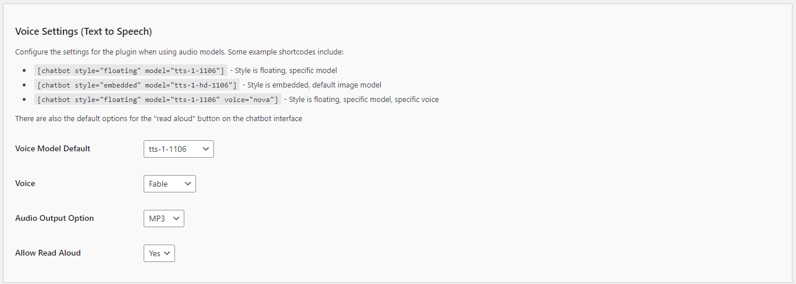

# Configuring the Voice Settings (Text to Speech)

To enhance your Kognetiks Chatbot with text-to-speech capabilities, follow these steps to configure the Voice Settings:

1. **Voice Model Default**:
   - **Description**: This dropdown allows you to select the default text-to-speech model the chatbot will use.
   - **Options**: Choose from various models such as `tts-1-1106` and others provided by OpenAI.
   - **Selection**: Select the model that best fits your needs for voice synthesis quality and features.

2. **Voice**:
   - **Description**: This setting lets you choose the specific voice the text-to-speech model will use.
   - **Options**: Available voices include options like `Fable`, `Nova`, etc.
   - **Selection**: Pick a voice that aligns with the desired personality and tone of your chatbot.

3. **Audio Output Option**:
   - **Description**: This setting specifies the format for the audio output.
   - **Options**: Common formats include `MP3` and others supported by the plugin.
   - **Selection**: Choose the format that works best for your application's compatibility and performance needs.

4. **Allow Read Aloud**:
   - **Description**: This toggle allows you to enable or disable the "read aloud" feature for the chatbot interface.
   - **Options**: `Yes` to enable, `No` to disable.
   - **Selection**: Enable this feature if you want the chatbot to provide audio responses, enhancing accessibility and user experience.

## Steps to Configure

1. Navigate to the Voice Settings section of the Kognetiks Chatbot plugin in your WordPress dashboard.

2. Select the desired model from the `Voice Model Default` dropdown.

3. Choose the preferred `Voice` from the available options.

4. Set the `Audio Output Option` by selecting the desired audio format, such as `MP3`.

5. Toggle the `Allow Read Aloud` setting to `Yes` if you want to enable audio responses.

6. Save the settings.

## Example Shortcodes

Here are some example shortcodes you can use to customize the chatbot's text-to-speech functionality within your WordPress site:

- `[chatbot style="floating" model="tts-1-1106"]`: Style is floating, specific model.

- `[chatbot style="embedded" model="tts-1-hd-1106"]`: Style is embedded, default image model.

- `[chatbot style="floating" model="tts-1-1106" voice="nova"]`: Style is floating, specific model, specific voice.

## Tips

- **Voice Selection**: Experiment with different voices to find the one that best fits the tone and personality of your chatbot.

- **Format Compatibility**: Ensure the audio output format you choose is compatible with the platforms and devices your users commonly use.

- **User Experience**: Enabling the "read aloud" feature can significantly enhance the user experience, particularly for users who prefer auditory information or have accessibility needs.

By configuring these settings, you ensure that your Kognetiks Chatbot provides a rich, engaging, and accessible interaction experience through high-quality text-to-speech capabilities.

