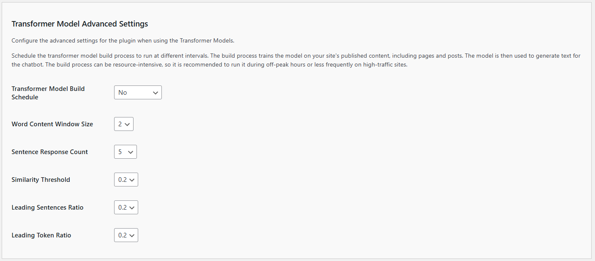

#Configuring Transformer Model Settings

To ensure your Kognetiks Chatbot functions optimally, you need to configure the chat settings appropriately. Here's a detailed guide on how to use these settings:

## Model Selection

1. **Transformer Model Choice**:
   - **Description**: This setting allows you to choose the default Transformer model your chatbot will use.
   - **Options**: Depending on the available models, you can select from various options such as `contextual-context-model`, `sentential-context-model`, etc.
   - **How to Set**: Select the desired model from the dropdown menu. For instance, `sentential-context-model`.

2. **Maximum Tokens Setting**:
   - **Description**: This setting determines the maximum number of tokens (words and parts of words) the model can use in a single response. This helps control the length and detail of the responses.
   - **Default Value**: The default is set to 500 tokens, but it can be increased up to 4000 tokens.
   - **How to Set**: Enter the desired number of tokens in the provided field. For example, `1000`.

## Model Build Status

1. **Sechedule to Run**:
    TO BE WRITTEN

2. **Status of Last Run**:
    TO BE WRITTEN

3. **Content Items Processed**:
    TO BE WRITTEN

## Advanced Settings

1. **Scheduled to Run**:

   - **Description**: This dropdown allows you to set the frequency at which the Knowledge Navigator scans your website content.
   - **Options**: 
     - `No`: No schedule has been set.
     - `Now`: Runs the scan immediately - non-recurring schedule.
     - `Hourly`: Runs the scan every hour.
     - `Twice Daily`: Runs the scan twice a day.
     - `Daily`: Runs the scan once a day.
     - `Weekly`: Runs the scan once a week.
     - `Disable`: Disables the scheduled runs altogether.
     - `Cancel`: Stops the current run.
   - **Selection**: Choose the frequency that best suits your content update schedule. For frequently updated sites, `Hourly` or `Daily` is recommended.

2. **Word Content Windows Size**:
    - **Description**: This set the ngram size when building the transformer model.
    - **Defualt Value**: The default is set to 2.
    - **How to Set**: Use the dropdown menu to select a value between 1 and 5.
    - **Tip**: The higher the setting the more sentive the model, i.e., more words will need to match the input window.  The lower the setting, fewer words will be considered.  Experiment with various settings to determine what works best with your content.
    - **NOTE**: When changing this setting you may need to manually update the build schedule to force a rebuild of the transformer model cache.

3. **Sentence Response Count**:
    TO BE WRITTEN

4. **Similarity Threshold**:
    TO BE WRITTEN

5. **Leading Sentences Ratio**:
    TO BE WRITTEN

6. **Leading Token Ratio**:
    TO BE WRITTEN

