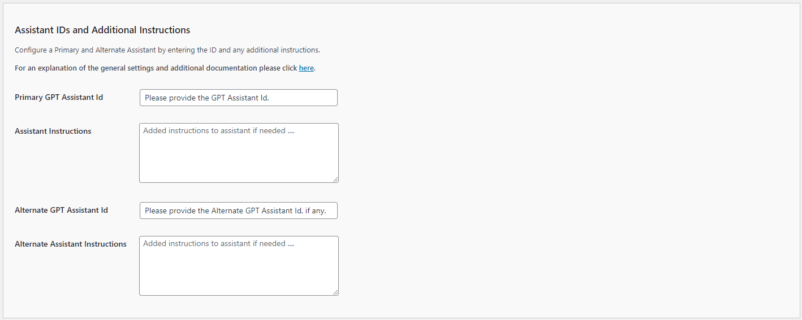

# Configurating the Assistant Settings

Configure settings for your Assistants by adding your below.

If you have developed a Assistant, you will need the id of the assistant - is usually starts with "asst_".

Enter your Assistant ID instead of ChatGPT. Set the 'Use Assistant ID' to 'Yes'.

Otherwise, you can leave the Assistant ID field blank and set the usage to 'No'.

More information can be found here https://platform.openai.com/playground?mode=assistant.

## Using Multiple Assistants

You can integrate Assistants into your platform using one of shortcode configurations below.

Each configuration requires either 'primary', 'alternate' or a Assistant ID, denoted as 'asst_xxxxxxxxxxxxxxxxxxxxxxxx'.

Assistants work with both 'floating' and 'embedded' styles.

**NOTE:** The 'primary' and 'alternate' assistants are set in the ChatGPT settings page.

**NOTE:** For best results ensure that the shortcode appears only once on the page.

## Configuring the Assistant General Settings

These settings allow you to configure the behavior and capabilities of the Assistant in your Kognetiks Chatbot. Follow these steps to set up these options:

1. **Use GPT Assistant Id**:
   - **Description**: This toggle allows you to enable or disable the use of a specific Assistant ID.
   - **Options**: `Yes` or `No`.
   - **Selection**: Choose `Yes` to use a specific Assistant ID for personalized assistant configurations.

2. **Allow File Uploads**:
   - **Description**: This setting allows users to upload files through the chatbot interface.
   - **Options**: `Yes` or `No`.
   - **Selection**: Choose `Yes` if you want to enable file uploads, facilitating richer interactions.

3. **Display GPT Assistant Name**:
   - **Description**: This toggle controls whether the Assistant's name is displayed in interactions.
   - **Options**: `Yes` or `No`.
   - **Selection**: Choose `Yes` to display the assistant's name for a more personalized user experience.

## Assistant IDs and Additional Instructions

1. **Primary GPT Assistant Id**:
   - **Description**: This field is for specifying the primary Assistant ID.
   - **Input**: Enter the Assistant ID provided by OpenAI or your specific setup.

2. **Assistant Instructions**:
   - **Description**: This field allows you to provide specific instructions to the primary assistant.
   - **Input**: Enter any special instructions or context that will guide the assistant's responses.

3. **Alternate GPT Assistant Id**:
   - **Description**: This field is for specifying an alternate Assistant ID, used as a fallback.
   - **Input**: Enter the alternate Assistant ID if you have one.

4. **Alternate Assistant Instructions**:
   - **Description**: This field allows you to provide specific instructions to the alternate assistant.
   - **Input**: Enter any special instructions or context for the alternate assistant.

## Advanced Additional Settings

1. **Max Prompt Tokens**:
   - **Description**: This setting determines the maximum number of tokens for the input prompt.
   - **Options**: A numeric value betweem `1,000` and `20,000` (the default is `20000`).
   - **Selection**: Set this based on the complexity of the queries you expect. Higher values allow for longer inputs.

2. **Max Response Tokens**:
   - **Description**: This setting determines the maximum number of tokens for the assistant's response.
   - **Options**: A numeric value betweem `1,000` and `20,000` (the default is `20000`).
   - **Selection**: Set this based on the level of detail you want in the responses. Higher values allow for longer responses.

3. **Thread Retention Period (hrs)**:
    - **Description**: This setting specifies how long conversation threads are retained.
    - **Options**: A numeric value between 6 and 720 hours (the default is `36` hours).
    - **Selection**: Choose a duration that balances user privacy with the need for context in ongoing conversations.

4. **Beta Assistant Version**:
    - **Description**: This setting allows you to select the version of the beta assistant to use.
    - **Options**: Versions `V1` and `v2` (the default is now `V2`).
    - **Selection**: Choose the version that fits your needs, typically the latest for the most up-to-date features.

## Steps to Configure

1. Navigate to the GPT Assistant settings section of the Kognetiks Chatbot plugin in your WordPress dashboard.

2. Toggle `Use GPT Assistant Id` to `Yes` if you want to use specific assistant IDs.

3. Enable `Allow File Uploads` by setting it to `Yes` if you want users to upload files.

4. Enable `Display GPT Assistant Name` by setting it to `Yes` to show the assistant's name during interactions.

5. Enter the `Primary GPT Assistant Id` provided by OpenAI or your setup.

6. Add any `Assistant Instructions` to guide the primary assistant's behavior.

7. Enter an `Alternate GPT Assistant Id` if you have one.

8. Add any `Alternate Assistant Instructions` to guide the alternate assistant.

9. Set the `Max Prompt Tokens` to a suitable value based on your needs.

10. Set the `Max Response Tokens` to a suitable value based on your needs.

11. Choose an appropriate `Thread Retention Period (hrs)` for retaining conversation context.

12. Select the desired `Beta Assistant Version` from the dropdown.

13. Save the settings.

## Example Usage

Use the following format to invoke the primary or alternate assistant:

- `[chatbot style="floating" assistant="primary"]` - Floating style, Assistant as set in Primary setting

- `[chatbot style="embedded" assistant="alternate"]` - Embedded style, Assistant as set in Alternate setting

- `[chatbot style="floating" assistant="asst_xxxxxxxxxxxxxxxxxxxxxxxx"]` - Floating style, Assistant as set in Assistant ID setting

- `[chatbot style="embedded" assistant="asst_xxxxxxxxxxxxxxxxxxxxxxxx"]` - Embedded style, Assistant as set in Assistant ID setting
Mix and match the style and assistant attributes to suit your needs.

**NOTE:** When using the 'embedded' style, it's best to put the shortcode in a page or post, not in a footer.

## Tips

- **Assistant Instructions**: Provide clear and concise instructions to tailor the assistant’s responses to your specific needs.

- **Token Limits**: Adjust token limits based on the balance between detailed responses and performance considerations.

- **Retention Period**: A longer retention period can improve user experience by maintaining context but consider privacy implications.

By configuring these settings, you ensure that your Kognetiks Chatbot can effectively utilize the Assistant to provide personalized and contextually aware interactions for your users.

## More Information

See [Chatbots and Assistants](support/chatbots-and-assistants.md) for more details on using multiple Assistants.
